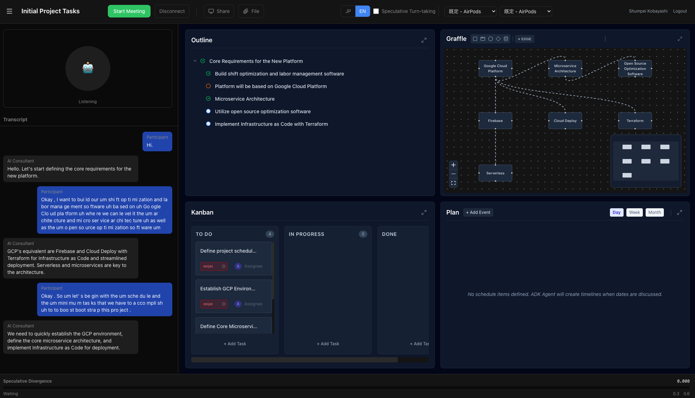
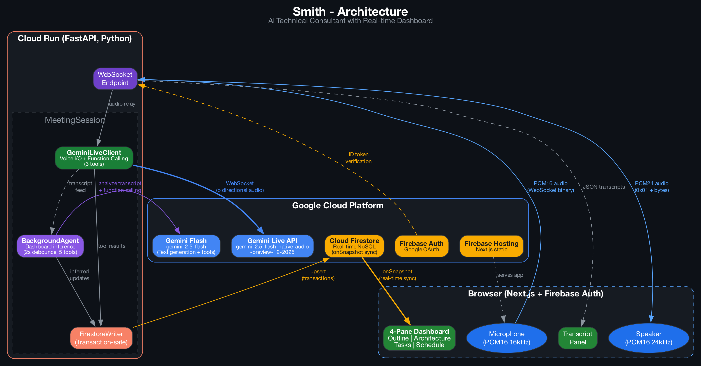

# Smith - AI Technical Consultant with Real-time Dashboard



> An AI technical consultant that conducts requirements definition and architecture design meetings through natural voice conversation. As you speak, Smith automatically generates and updates a 4-pane dashboard: requirements outline, architecture diagram, task board, and project timeline.

Built for the [Gemini Live Agent Challenge](https://geminiliveagentchallenge.devpost.com/) hackathon.

## What It Does

Smith is your AI architect co-pilot for technical meetings. Start a voice conversation, discuss your project, and watch as structured artifacts are generated in real-time:

1. **Voice Conversation**: Speak naturally with an expert IT architect who asks clarifying questions, identifies risks, and proposes solutions
2. **4-Pane Auto-Generation**: The dashboard populates as you talk:
   - **Outline**: Hierarchical requirements, goals, and assumptions
   - **Architecture**: System component diagram with nodes and connections
   - **Tasks**: Kanban board (todo / in_progress / done)
   - **Schedule**: Gantt chart with milestones and dependencies
3. **Bidirectional Editing**: Edit any pane manually — the AI notices and adapts
4. **Bilingual**: Switch between Japanese and English mid-session

## Architecture



### Three Parallel Agents

| Agent | Model | Role |
|-------|-------|------|
| **GeminiLiveClient** | gemini-2.5-flash-native-audio-preview-12-2025 | Real-time voice conversation + function calling |
| **BackgroundAgent** | gemini-2.5-flash | Analyzes transcript, infers dashboard updates (2s debounce) |
| **FirestoreWriter** | Cloud Firestore | Transaction-safe real-time sync to frontend |

### Data Flow

```
Browser (Next.js)
  │ WebSocket (PCM16 16kHz audio + JSON)
  ▼
Cloud Run (FastAPI, Python)
  ├── GeminiLiveClient ──WebSocket──▶ Gemini Live API
  │     Voice I/O + Function Calling      (native audio model)
  ├── BackgroundAgent ──API call──▶ Gemini Flash
  │     Transcript analysis → Dashboard updates
  └── FirestoreWriter ──▶ Cloud Firestore
                              ▲
Browser listens via onSnapshot ─┘  (real-time 4-pane sync)
```

### Key Technologies

- **Gemini Live API** (`gemini-2.5-flash-native-audio-preview-12-2025`): Full-duplex audio I/O with function calling
- **Gemini Flash** (`gemini-2.5-flash`): Background transcript analysis and dashboard inference
- **Google GenAI SDK** (`google-genai`): Python SDK for all Gemini APIs
- **Cloud Run**: WebSocket-capable serverless container (4GB RAM)
- **Cloud Firestore**: Real-time document sync with transaction-safe upserts
- **Firebase Auth**: Google OAuth with ID token verification
- **Next.js 15 + React 19**: Frontend with @xyflow/react (diagrams), gantt-task-react (timeline), dnd-kit (drag-and-drop)

## Features

- **Voice Meeting with AI Consultant**: Discuss system requirements naturally; AI asks clarifying questions, identifies risks
- **Real-time Dashboard Generation**: 4 panes auto-populate from conversation via Gemini function calling + BackgroundAgent inference
- **Auto-Focus Panes**: When the AI edits a pane, it maximizes automatically for 4 seconds
- **Session Persistence**: Resume previous meetings with full context restoration
- **Resizable Layout**: Drag to resize the chat panel (saved to localStorage)
- **Language Toggle**: JP/EN switch changes AI voice and dashboard output language
- **Firebase Auth**: Google login with secure WebSocket token verification

## Project Structure

```
Smith/
├── backend/                    # Cloud Run (Python/FastAPI)
│   ├── src/
│   │   ├── main.py             # FastAPI WebSocket endpoint
│   │   ├── gemini_live_client.py   # Gemini Live API wrapper
│   │   ├── session_manager.py  # Session orchestration
│   │   ├── adk_agent.py        # Background agent (Gemini Flash)
│   │   ├── firestore_writer.py # Transaction-safe Firestore sync
│   │   ├── function_tools.py   # Gemini function declarations
│   │   ├── system_prompt.py    # Bilingual consultant prompt
│   │   └── config.py           # Settings
│   ├── Dockerfile
│   └── requirements.txt
├── frontend/                   # Next.js (Firebase Hosting)
│   └── src/
│       ├── components/         # MeetingRoom, Outline, Graffle, Focus, Plan
│       ├── hooks/              # useAudioStream, useFirestore, useDevices
│       ├── contexts/           # AuthContext (Firebase Auth)
│       └── lib/                # Firebase config
└── doc/                        # Architecture diagrams, demo scripts
```

## Setup & Deployment

### Prerequisites
- Google Cloud project with billing enabled
- [gcloud CLI](https://cloud.google.com/sdk/docs/install) authenticated
- [Firebase CLI](https://firebase.google.com/docs/cli) installed (`npm install -g firebase-tools`)
- Docker Desktop installed
- Node.js 20+ and Python 3.12+
- Gemini API key (from [Google AI Studio](https://aistudio.google.com/))

### 1. GCP Setup

```bash
# Set your project
export PROJECT_ID=your-project-id
export REGION=asia-northeast1

# Enable required APIs
gcloud services enable \
  run.googleapis.com \
  firestore.googleapis.com \
  artifactregistry.googleapis.com \
  identitytoolkit.googleapis.com \
  secretmanager.googleapis.com \
  --project=$PROJECT_ID

# Create Artifact Registry repository
gcloud artifacts repositories create smith \
  --repository-format=docker \
  --location=$REGION \
  --project=$PROJECT_ID

# Create Firestore database (if not exists)
gcloud firestore databases create --location=$REGION --project=$PROJECT_ID

# Store Gemini API key in Secret Manager
echo -n "your-gemini-api-key" | gcloud secrets create google-api-key \
  --data-file=- --project=$PROJECT_ID

# Configure Docker auth
gcloud auth configure-docker $REGION-docker.pkg.dev
```

### 2. Deploy Backend

```bash
# Build and push Docker image
docker build --platform linux/amd64 \
  -t $REGION-docker.pkg.dev/$PROJECT_ID/smith/backend:latest \
  ./backend

docker push $REGION-docker.pkg.dev/$PROJECT_ID/smith/backend:latest

# Deploy to Cloud Run
gcloud run deploy smith-backend \
  --project=$PROJECT_ID \
  --region=$REGION \
  --image=$REGION-docker.pkg.dev/$PROJECT_ID/smith/backend:latest \
  --allow-unauthenticated \
  --memory=4Gi \
  --concurrency=80 \
  --set-secrets=GOOGLE_API_KEY=google-api-key:latest \
  --set-env-vars=GCP_PROJECT_ID=$PROJECT_ID
```

### 3. Firebase Setup

```bash
# Initialize Firebase project (link to existing GCP project)
firebase login
firebase projects:addinitialize --project $PROJECT_ID

# Enable Google sign-in in Firebase Console:
# Firebase Console > Authentication > Sign-in method > Google > Enable
```

### 4. Deploy Frontend

```bash
cd frontend

# Install dependencies
npm install

# Configure environment
cat > .env.local << EOF
NEXT_PUBLIC_BACKEND_WS_URL=wss://smith-backend-XXXXX.$REGION.run.app/ws/meeting
NEXT_PUBLIC_FIREBASE_API_KEY=your-firebase-api-key
NEXT_PUBLIC_FIREBASE_AUTH_DOMAIN=$PROJECT_ID.firebaseapp.com
NEXT_PUBLIC_FIREBASE_PROJECT_ID=$PROJECT_ID
EOF

# Build and deploy
npm run build
firebase deploy --only hosting --project=$PROJECT_ID
```

### 5. Local Development

```bash
# Backend (terminal 1)
cd backend
pip install -r requirements.txt
GOOGLE_API_KEY=your_key GCP_PROJECT_ID=your_project python -m src.main
# Runs on http://localhost:8080

# Frontend (terminal 2)
cd frontend
# Set NEXT_PUBLIC_BACKEND_WS_URL=ws://localhost:8080/ws/meeting in .env.local
npm run dev
# Runs on http://localhost:3000
```

## How It Works

### Hybrid Architecture: Live + Background

**Gemini Live** handles the voice conversation with 3 function tools (extract_requirement, update_summary, ask_clarification). When the user explicitly mentions something, the AI captures it immediately.

**BackgroundAgent** runs in parallel with a 2-second debounce. It reads the latest transcript, fetches the current dashboard state from Firestore, and uses Gemini Flash to infer what should be added or updated across all 4 panes. This handles implicit context — things the user discussed but didn't explicitly ask to be captured.

Both agents write to Firestore using transactions, ensuring no race conditions when concurrent updates occur.

### Real-time Sync

The frontend uses Firestore's `onSnapshot` listeners for all 4 panes. Any change from either the Live API, BackgroundAgent, or user manual edits is reflected instantly across all connected clients.

## License

MIT

## Hackathon

Built for **Gemini Live Agent Challenge** on Devpost.

\#GeminiLiveAgentChallenge
